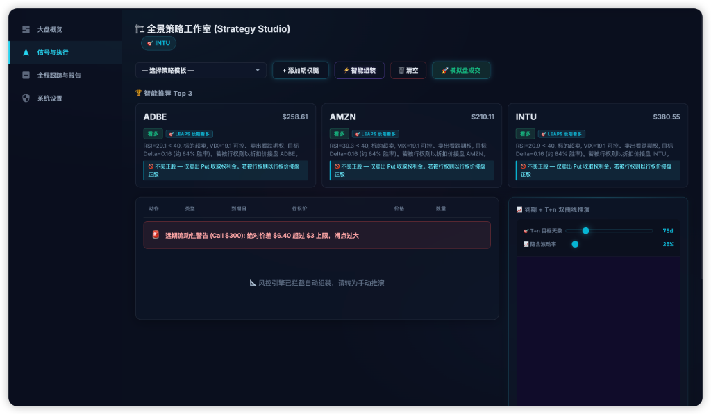
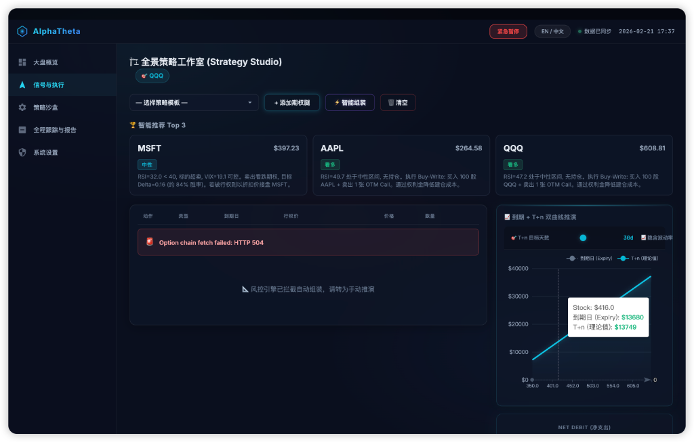
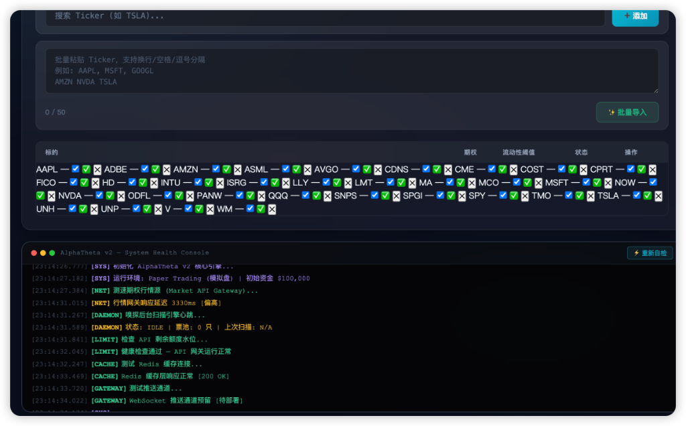
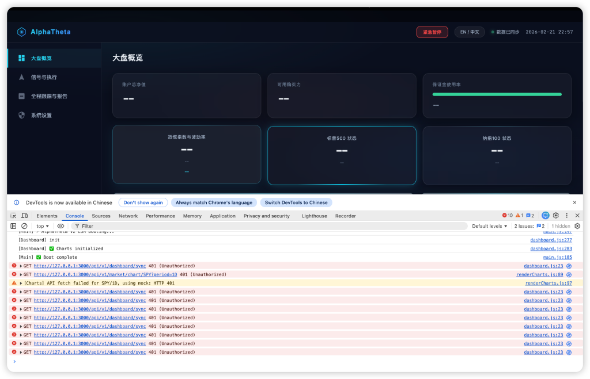

<p align="center">
  
</p>

<h1 align="center">AlphaTheta v2</h1>

<p align="center">
  <strong>自动化期权策略引擎 · Automated Options Strategy Engine</strong>
</p>

<p align="center">
  
  
  
  
  
  
</p>

---

## 📖 简介

**AlphaTheta** 是一款面向美股期权交易者的**金融级量化交易 SaaS 平台**。系统融合宏观技术分析、AI 信号引擎与多腿期权组合构建器，提供从行情扫描到模拟交易的全链路闭环体验。

### 核心价值主张

- 🔬 **智能扫描引擎** — 异步 Daemon 持续扫描自选池，基于 RSI / VIX / 波动率 / IV Rank 多维度评分，实时推送 Top 3 信号
- ⚡ **一键策略组装** — 点击推荐卡片即可自动组装 LEAPS / Spread / Buy-Write / Iron Condor 等多腿策略
- 📊 **到期+T+n 双曲线推演** — ECharts 驱动的实时收益图，支持 DTE / IV 拖拽模拟
- 🛡️ **金融级风控** — Kill Switch 熔断、流动性警告、保证金估算、最大亏损锁定
- 📋 **模拟盘交易** — Paper Trade 一键成交，Portfolio HUD 实时追踪持仓希腊值

---

## 🖼️ 产品截图

### 全景策略工作室 (Strategy Studio)

> 核心操作台 — AI 推荐 Top 3 信号 → 一键组装 → 收益推演 → 模拟成交

<p align="center">
  
  <br/>
  <em>策略工作室：Top 3 推荐信号卡片 + 多腿期权构建器 + 到期日双曲线推演 + 模拟盘成交</em>
</p>

### 收益曲线推演

> 拖动 T+n 天数和隐含波动率滑块，实时预览策略盈亏

<p align="center">
  
  <br/>
  <em>到期日 (Expiry) + T+n 理论值双曲线图 · 价格 / 盈亏联动 Tooltip</em>
</p>

### 扫描引擎 & 健康控制台

> Ticker 自选池管理 + 系统健康自检 (API 网关 / Redis / WebSocket / Daemon)

<p align="center">
  
  <br/>
  <em>批量 Ticker 导入 + 期权/波动性阈值过滤 + System Health Console</em>
</p>

### 大盘概览 (Dashboard)

> 宏观视图 — 账户净值 / 可用购买力 / 保证金使用率 / 恐慌指数 / SPY / QQQ 状态

<p align="center">
  
  <br/>
  <em>Glassmorphism 仪表盘 · 实时环境指标 · Paper / Live 模式切换</em>
</p>

---

## 🏗️ 系统架构

```
┌─────────────────────────────────────────────────────────────────────┐
│                          Frontend (SPA)                             │
│  Vanilla JS (ES Modules) + ECharts + Glassmorphism CSS              │
├─────────────────────────────────────────────────────────────────────┤
│                       Nginx Reverse Proxy (:80)                     │
│  静态资源 + /api/* → FastAPI + /ws/* → WebSocket                     │
├─────────────────────────────────────────────────────────────────────┤
│                      FastAPI Gateway (:8000)                        │
│                                                                     │
│  ┌─────────────┐  ┌──────────┐  ┌──────────┐  ┌──────────────┐    │
│  │  TraceID MW  │→│ RateLimit │→│ KillSwitch│→│  Calendar MW  │    │
│  └─────────────┘  └──────────┘  └──────────┘  └──────────────┘    │
│                         ↓                                           │
│  ┌─────────┐  ┌──────────┐  ┌──────────┐  ┌────────────────┐      │
│  │Dashboard │  │ Strategy │  │ Execution│  │  Market Data   │      │
│  │  Router  │  │  Router  │  │  Router  │  │    Router      │      │
│  └─────────┘  └──────────┘  └──────────┘  └────────────────┘      │
│                                                                     │
│  ┌─────────────────────────────────────────────────────────────┐   │
│  │              Services Layer (26 modules)                     │   │
│  │  scanner_daemon · risk_engine · order_manager · margin       │   │
│  │  signal_publisher · reconciliation · strategy_lifecycle      │   │
│  └─────────────────────────────────────────────────────────────┘   │
├─────────────────────────────────────────────────────────────────────┤
│  PostgreSQL 16     │  Redis 7 (Cache/PubSub)  │  WebSocket Feed    │
└─────────────────────────────────────────────────────────────────────┘
```

---

## 🧩 功能模块

| 模块 | 描述 | 状态 |
|------|------|------|
| **大盘概览** | 账户净值 / 购买力 / 保证金率 / VIX 恐慌指数 / SPY·QQQ 状态卡 | ✅ |
| **策略工作室** | AI Top 3 推荐 → LEAPS / Spread / Buy-Write 自动组装 → 多腿构建器 | ✅ |
| **收益推演** | 到期日 + T+n 双曲线 · DTE / IV 滑块 · Greeks HUD (Δ Γ Θ Vega) | ✅ |
| **Paper Trade** | 一键模拟成交 · 持仓追踪 · P&L 核算 · 初始资金 $100,000 | ✅ |
| **扫描引擎** | 异步 Daemon · 自选池管理 · RSI/VIX/IV 多维评分 · 信号推送 | ✅ |
| **实时信号流** | WebSocket 推送 · 防打扰 UI 锁 · 信号 TTL 保鲜 · REST 补偿 | ✅ |
| **风控引擎** | Kill Switch 熔断 · 流动性警告 · 保证金估算 · 最大亏损计算 | ✅ |
| **混合资产** | Stock + Option 混合腿 (Buy-Write) · 类型感知乘数·统一成交 | ✅ |
| **结构化日志** | Loguru JSON 轮转 · Trace ID 全链路 · 金融级脱敏 | ✅ |
| **系统设置** | 环境切换 (Paper/Live) · API Key 管理 · 通知配置 | ✅ |
| **健康自检** | API 网关 / Redis / WebSocket / Daemon / 行情延迟检测 | ✅ |

---

## ⚙️ 技术栈

### 前端

| 技术 | 用途 |
|------|------|
| **Vanilla JS (ES Modules)** | 零框架 SPA，极致轻量 |
| **ECharts 5** | 收益曲线 / 行情图表 |
| **CSS3 Glassmorphism** | 深色主题 + 毛玻璃 + 动态动画 |
| **WebSocket** | 实时信号流 + 防打扰机制 |

### 后端

| 技术 | 用途 |
|------|------|
| **FastAPI** | 异步 API 网关 (14 Routers) |
| **PostgreSQL 16** | 持久化 (SQLAlchemy 2.0 async) |
| **Redis 7** | 缓存 / PubSub / Kill Switch |
| **Loguru** | 结构化日志 (JSON + 脱敏 + Trace ID) |
| **OpenTelemetry** | 分布式追踪 (OTLP) |
| **APScheduler** | 定时任务调度 |
| **Docker Compose** | 容器化部署 |

---

## 🚀 快速开始

### 前置要求

- Docker + Docker Compose v2
- 市场数据 API Key (Tradier / Yahoo Finance)

### 部署

```bash
# 1. 克隆仓库
git clone <repo-url> alphatheta && cd alphatheta

# 2. 配置环境变量
cp backend/.env.example backend/.env
# 编辑 .env 填入 API Key、数据库密码等

# 3. 一键启动
cd backend && docker compose up -d

# 4. 访问
open http://localhost:8080
```

### 服务端口

| 服务 | 端口 | 说明 |
|------|------|------|
| Web (Nginx) | `8080` | 前端 SPA + API 反向代理 |
| API (FastAPI) | `8000` | 后端 API (容器内部) |
| PostgreSQL | `5432` | 数据库 (容器内部) |
| Redis | `6379` | 缓存/PubSub (容器内部) |

---

## 📁 项目结构

```
alphatheta/
├── docker-compose.yml          # 全局编排 (根目录)
├── README.md
├── .gitignore
│
├── frontend/                   # 前端 SPA
│   ├── Dockerfile              # Nginx 静态服务
│   ├── nginx.conf              # SPA fallback + API 反代
│   ├── index.html
│   ├── style.css
│   ├── app.js
│   ├── renderCharts.js
│   └── js/
│       ├── main.js             # 应用引导 + 路由
│       ├── views/              # 页面视图
│       ├── services/           # Paper Trade / Signal Stream
│       ├── utils/              # 收益引擎 / 策略组装 / BS 定价
│       └── store/              # 全局状态
│
├── backend/                    # Python 后端
│   ├── Dockerfile              # FastAPI 多阶段构建
│   ├── pyproject.toml
│   ├── .env / .env.example
│   ├── scanner_entry.py
│   └── app/
│       ├── main.py             # FastAPI 应用工厂
│       ├── config.py           # Pydantic Settings
│       ├── routers/            # 14 个 API 路由模块
│       ├── services/           # 26 个业务服务
│       ├── models/             # 14 个 SQLAlchemy 模型
│       ├── middleware/         # TraceID / RateLimit / KillSwitch / Auth
│       ├── logging/            # Loguru 结构化日志中枢
│       ├── websocket/          # WebSocket Feed
│       ├── scheduler/          # APScheduler 定时任务
│       ├── adapters/           # Tradier / Yahoo 行情适配器
│       └── telemetry/          # OpenTelemetry SDK
│
├── deploy/                     # 部署配置
│   ├── k8s/                    # Kubernetes manifests
│   └── ecosystem.config.js     # PM2 配置
│
├── docs/screenshots/           # 产品截图
└── openspec/                   # 变更管理 (OpenSpec)
```

---

## 🔐 安全特性

- **JWT 认证** — 无状态 Token 验证，支持角色权限
- **日志脱敏** — `password / token / api_key / Authorization` 自动掩码为 `***[MASKED]***`
- **全链路 Trace ID** — 每个请求 UUID 追踪，响应 `X-Trace-ID` header
- **Kill Switch** — 一键熔断所有交易操作，状态持久化 (Redis + PG)
- **Rate Limiting** — API 请求频率限制
- **环境隔离** — Paper (模拟盘) / Live (实盘) 严格分离

---

## 🛣️ Roadmap

- [ ] 实盘券商对接 (Tradier / IBKR)
- [ ] 持仓到期日自动滚仓
- [ ] 策略回测引擎
- [ ] 多用户 SaaS 租户隔离
- [ ] 移动端 PWA
- [ ] AI 策略推荐 v2 (LLM 推理)

---

## 📄 License

Proprietary — All rights reserved.

---

<p align="center">
  <sub>Built with ❤️ by AlphaTheta Team · 2026</sub>
</p>
