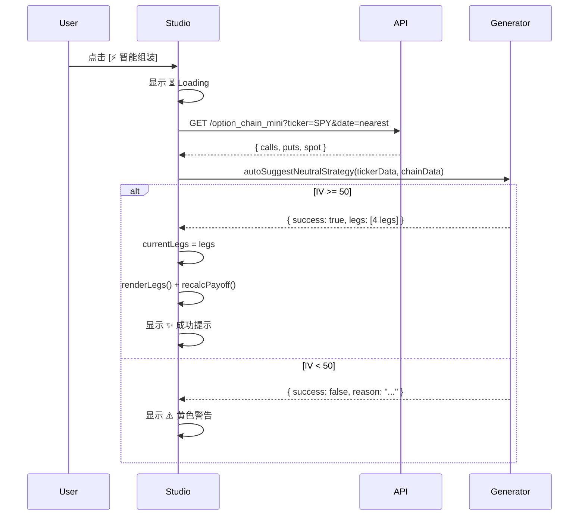

## Architecture

纯前端模块 — 无后端变更。新增 1 个工具模块 + 修改 1 个视图。

```
js/utils/strategy-generator.js  → [NEW] 核心算法 (ESM, 纯函数)
js/views/strategy_studio.js     → [MODIFY] 增加 onAutoSuggest() 流程
index.html                      → [MODIFY] 添加 "智能组装" 按钮
style.css                       → [MODIFY] 加载态 + 警告样式
```

## Algorithm: Discrete Strike Addressing

### 核心寻址函数: `findClosestStrike(chain, targetPrice)`

```
strikes = chain.map(c => c.strike).sort()
bestIdx = strikes.reduce((best, s, i) =>
    Math.abs(s - targetPrice) < Math.abs(strikes[best] - targetPrice) ? i : best,
    0
)
return chain.find(c => c.strike === strikes[bestIdx])
```

### Iron Condor 4 步构建

```
Step 1: shortPut  = findClosestStrike(puts,  spot * 0.95)
Step 2: longPut   = findClosestStrike(puts,  shortPut.strike - WING_WIDTH)
Step 3: shortCall = findClosestStrike(calls, spot * 1.05)
Step 4: longCall  = findClosestStrike(calls, shortCall.strike + WING_WIDTH)

WING_WIDTH = 5  // 固定 $5, 不使用百分比
```

### 报价验证

```
validate(contract, side):
    if side === 'sell' && (!contract.bid || contract.bid <= 0):
        throw NO_LIQUIDITY
    if side === 'buy'  && (!contract.ask || contract.ask <= 0):
        throw NO_LIQUIDITY
```

### Leg 输出格式

每条腿遵循 `currentLegs` 的已有 schema:
```javascript
{
    id: crypto.randomUUID(),
    type: "option",
    right: "put" | "call",
    action: "buy" | "sell",
    expiration: chainExpDate,
    strike: contract.strike,
    quantity: 1,
    price: side === 'sell' ? contract.bid : contract.ask,
    multiplier: 100,
}
```

## UI 交互流程



## 风险

| 风险 | 缓解 |
|------|------|
| 期权链数据延迟 | UI 显示 "数据截至 HH:MM" |
| 流动性不足 | 异常上浮为用户警告 |
| 行权价间距非 $5 | 算法自动寻找最近档位 |
